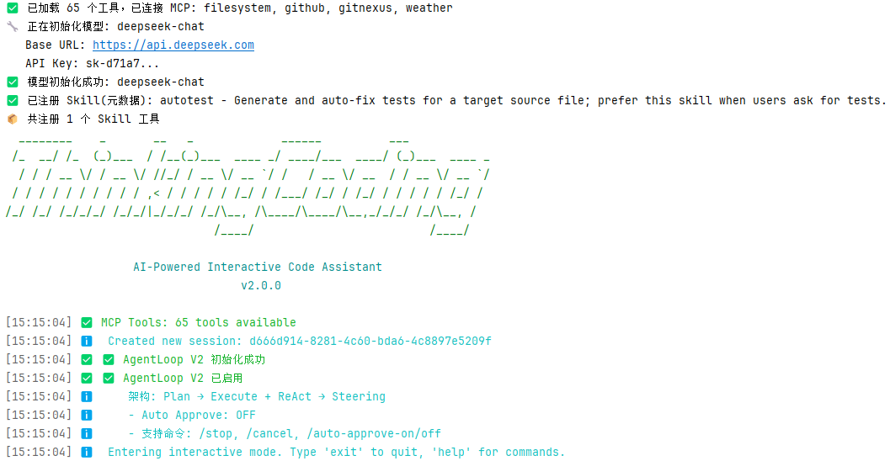

# ThinkingCoding CLI



基于 LangChain4j 的交互式 AI 代码助手 CLI 工具，支持流式对话、工具调用、MCP 协议集成和可扩展的 Skill 工作流。

## 项目特性

- **V2 Agent 编排** — Plan → Execute + ReAct → Steering 三阶段流水线，支持自动批准和转向控制
- **流式对话** — Token-by-Token 实时输出，支持中途停止生成
- **MCP 集成** — 完整的 Model Context Protocol 客户端，支持多服务器同时连接、动态发现工具
- **Skill 工作流** — 可扩展的 Skill 模块系统，AI 可自动发现和调用（内置 AutoTest 自动测试生成）
- **代码图索引** — 基于 Java AST + GitNexus 的代码符号索引（CodeGraph），支持符号查找和依赖分析
- **RAG 语义检索** — 图嵌入索引（pgvector）+ 语义搜索 + 混合定位器，自然语言精准检索代码
- **记忆引擎** — WorkingMemory 滑动窗口，Turn 分割 + Rolling Summary + 微压缩，预算精准控制
- **工具系统** — 内置文件管理、命令执行、代码执行、文本搜索、TODO 追踪、Remember 记忆工具
- **会话管理** — 会话保存/加载/继续，JSON 格式持久化
- **上下文管理** — 滑动窗口 Token 管理，当前任务上下文注入
- **终端 UI** — JLine + ANSI 现代化终端界面，支持代码高亮、进度指示、状态栏
- **项目感知** — 自动检测 Maven/Gradle/NPM 项目，提供项目上下文
- **工具确认** — 交互式工具执行确认，支持 /auto-approve-on|off 切换
- **跨平台** — Windows、Linux、macOS

## 项目结构

```
ThinkingCoding/
├── src/main/java/com/thinkingcoding/
│   ├── ThinkingCodingCLI.java                # CLI 入口
│   ├── TestClient.java                       # 测试用客户端
│   ├── cli/                                  # 命令行接口 (Picocli)
│   │   ├── ThinkingCodingCommand.java         # 主命令：交互模式、单词对话、V1/V2 切换
│   │   ├── SessionCommand.java               # 会话管理子命令
│   │   ├── ConfigCommand.java                # 配置管理子命令
│   │   ├── SkillCommand.java                 # Skill 管理子命令
│   │   └── MCPCommand.java                   # MCP 管理子命令
│   ├── core/                                 # 核心组件
│   │   ├── ThinkingCodingContext.java         # DI 容器 / 服务定位器
│   │   ├── AgentLoop.java                    # Legacy Agent 循环 (V1)
│   │   ├── MessageHandler.java               # 消息处理器
│   │   ├── StreamingOutput.java              # 流式输出处理
│   │   ├── ProjectContext.java               # 项目类型检测
│   │   ├── OptionManager.java                # AI 多选项管理
│   │   ├── ToolExecutionConfirmation.java    # 工具执行确认 (Legacy)
│   │   └── DirectCommandExecutor.java        # 直接命令执行器
│   ├── agentloop/v2/                         # V2 Agent 编排器
│   │   ├── orchestrator/
│   │   │   ├── AgentOrchestrator.java         # 三阶段编排器 (Plan → Execute+ReAct → Steering)
│   │   │   ├── AgentConfig.java              # Agent 配置
│   │   │   └── ReActDriver.java              # ReAct 驱动：执行-观察-反思循环
│   │   ├── plan/
│   │   │   ├── Planner.java                  # 规划器接口
│   │   │   └── LangChainPlanner.java         # LangChain4j 实现
│   │   ├── execute/
│   │   │   ├── ToolExecutionEngine.java      # 工具执行引擎接口
│   │   │   ├── DefaultToolExecutionEngine.java
│   │   │   ├── ToolResolver.java             # 工具解析器
│   │   │   ├── ToolExecutionOutcome.java
│   │   │   └── ToolResultFormatter.java
│   │   ├── steer/
│   │   │   ├── ToolConfirmationPolicy.java   # 确认策略接口
│   │   │   ├── InteractiveToolConfirmationPolicy.java  # 交互式实现
│   │   │   ├── SteeringCommand.java          # 转向命令枚举
│   │   │   ├── SteeringController.java
│   │   │   ├── SteeringHandle.java
│   │   │   └── ToolDecision.java
│   │   ├── gateway/
│   │   │   ├── SessionGateway.java           # 会话网关接口
│   │   │   ├── DefaultSessionGateway.java    # JSON 文件会话持久化
│   │   │   ├── AgentEventSink.java           # 事件接收器接口
│   │   │   └── DefaultAgentEventSink.java
│   │   └── model/
│   │       ├── TurnContext.java               # 回合上下文
│   │       ├── PlanRequest.java / PlanResult.java
│   │       ├── ExecuteReactResult.java
│   │       └── TodoItem.java / TodoStatus.java / TodoTracker.java
│   ├── mcp/                                  # MCP 客户端
│   │   ├── MCPClient.java                    # MCP 客户端核心
│   │   ├── MCPService.java                   # MCP 服务管理
│   │   ├── MCPToolManager.java              # MCP 工具注册与发现
│   │   ├── MCPToolAdapter.java              # MCP 工具适配器
│   │   ├── GitNexusStalenessChecker.java    # GitNexus 索引过期检查
│   │   └── model/ (MCPRequest, MCPResponse, MCPTool...)
│   ├── rag/                                  # RAG 检索增强
│   │   ├── codegraph/                        # 代码图索引
│   │   │   ├── CodeGraphIndex.java           # 代码符号索引
│   │   │   ├── CodeGraphSymbol.java          # 代码符号模型
│   │   │   ├── GitNexusCodeGraphMapper.java  # GitNexus → CodeGraph 映射
│   │   │   └── SymbolKind.java / ReferenceKind.java
│   │   ├── embedding/                        # 图嵌入索引
│   │   │   ├── EmbeddingService.java         # 嵌入服务 (DashScope API)
│   │   │   ├── GraphEmbeddingIndexer.java    # 图嵌入索引编排器
│   │   │   ├── GraphEmbeddingStore.java      # pgvector 存储层
│   │   │   └── GraphEnrichedDocument.java    # 图增强文档
│   │   └── retrieval/                        # 检索路由
│   │       ├── RagRouter.java                # RAG 路由决策
│   │       ├── RagContextEnricher.java       # RAG 上下文增强
│   │       └── RagRoutingDecision.java
│   ├── service/                              # 服务层
│   │   ├── AIService.java                    # AI 服务抽象
│   │   ├── LangChainService.java             # LangChain4j AI 服务
│   │   ├── SessionService.java               # 会话服务
│   │   ├── ContextManager.java               # 上下文管理器
│   │   ├── PerformanceMonitor.java           # 性能监控
│   │   └── memory/                           # 记忆引擎
│   │       ├── WorkingMemory.java            # 工作记忆 (滑动窗口+压缩)
│   │       ├── TurnSplitter.java            # Turn 分割器
│   │       ├── RollingSummary.java           # 滚动摘要
│   │       ├── MicroCompactor.java           # 微压缩器
│   │       ├── DeepSeekTokenCounter.java    # DeepSeek 精确 Token 计数
│   │       ├── FactStore.java                # 事实存储
│   │       └── WorkingMemoryConfig.java
│   ├── skill/                                # Skill 系统
│   │   ├── Skill.java                        # Skill 接口
│   │   ├── SkillRegistry.java                # Skill 注册表
│   │   ├── SkillFactory.java                 # Skill 工厂
│   │   ├── SkillContextLoader.java           # Skill 上下文加载
│   │   ├── LazySkillToolAdapter.java         # 延迟 Skill 工具适配器
│   │   └── autotest/ (AutoTestSkill, TestPromptBuilder)
│   ├── tools/                                # 内置工具
│   │   ├── BaseTool.java / ToolProvider.java / ToolRegistry.java
│   │   ├── file/FileManagerTool.java         # 文件管理
│   │   ├── exec/CommandExecutorTool.java     # 命令执行
│   │   ├── exec/CodeExecutorTool.java        # 代码执行
│   │   ├── search/GrepSearchTool.java        # 文本搜索
│   │   ├── rag/CodeGraphTool.java            # 代码图查询
│   │   ├── rag/SemanticSearchTool.java       # 语义搜索
│   │   ├── rag/HybridLocatorTool.java        # 混合定位器
│   │   ├── rag/GraphSearchTool.java          # 图谱搜索
│   │   ├── todo/AgentTodoTool.java           # TODO 追踪
│   │   └── memory/RememberTool.java          # Remember 记忆
│   ├── ui/                                   # 终端 UI
│   │   ├── ThinkingCodingUI.java             # UI 主控
│   │   ├── TerminalManager.java              # 终端管理
│   │   ├── AnsiColors.java                   # ANSI 颜色
│   │   └── component/ (ChatRenderer, InputHandler, ProgressIndicator, StatusBar, ToolDisplay)
│   ├── config/                               # 配置系统
│   │   ├── AppConfig.java / ConfigLoader.java / ConfigManager.java
│   │   └── MCPConfig.java / MCPServerConfig.java
│   ├── model/                                # 数据模型
│   │   ├── ChatMessage.java / SessionData.java / ModelConfig.java
│   │   └── ToolCall.java / ToolExecution.java / ToolResult.java
│   └── util/                                 # 工具类
│       ├── JsonUtils.java / FileUtils.java / ConsoleUtils.java / StreamUtils.java
├── src/main/resources/
│   ├── config.yaml                           # 默认配置文件
│   ├── thinkingcoding-banner.txt             # 启动横幅
│   └── tokenizer/deepseek-v3/                # DeepSeek V3 Tokenizer
├── src/test/java/ (25 个测试类)               # 单元测试
├── docs/                                      # 设计文档与基准测试
├── bin/thinking / bin/thinking.bat            # 启动脚本
└── pom.xml                                   # Maven 构建
```

### 构建

```bash
git clone https://github.com/zengxinyueooo/ThinkingCoding.git
cd ThinkingCoding
# 编辑 config.yaml，配置 API Key 和模型
mvn clean package
```

### 运行

```bash
# 交互模式 (默认 V2 AgentLoop)
./bin/thinking

# 继续上次会话
./bin/thinking -c

# 指定会话
./bin/thinking -S <session-id>

# 单词提问
./bin/thinking -p "帮我写一个 Java 工具类"

# 指定模型
./bin/thinking -m deepseek-chat

# 使用 Legacy AgentLoop
./bin/thinking --agent-loop legacy

# 启用自动批准
./bin/thinking --auto-approve

# 查看帮助
./bin/thinking help
```

Windows 使用 `.\bin\thinking.bat` 替换 `./bin/thinking`。

### 交互模式命令

```
💬 对话:
  <任意消息>        发送给 AI
  stop / 停止       停止当前生成

🔡 直接命令:
  java version      直接执行 Java 命令
  git status        直接执行 Git 命令
  /commands         列出所有支持直接执行的命令

⚠️ Steering (V2):
  /auto-approve-on  开启自动批准 (跳过工具确认)
  /auto-approve-off 关闭自动批准
  /stop             停止生成
  /cancel           取消当前回合

🔲 MCP:
  /mcp list                   列出已连接的 MCP 工具
  /mcp connect <name> <cmd>  连接 MCP 服务器
  /mcp tools <t1,t2>         使用预定义工具
  /mcp disconnect <name>     断开 MCP 服务器
  /mcp predefined            显示预定义工具

❌ exit / quit  退出
```

## 配置说明 (`config.yaml`)

```yaml
# AI 模型配置
models:
  deepseek-v4-flash:
    name: "deepseek-chat"
    baseURL: "https://api.deepseek.com"
    apiKey: "your-api-key-here"
    streaming: true
    maxTokens: 8000
    maxContextTokens: 1000000
    temperature: 0.7

defaultModel: "deepseek-v4-flash"

# 工具开关
tools:
  fileManager: { enabled: true, maxFileSize: 10485760, timeoutSeconds: 30 }
  commandExec: { enabled: true, maxFileSize: 10485760, timeoutSeconds: 30 }
  codeExecutor: { enabled: true, timeoutSeconds: 60, allowedLanguages: [java, python, javascript, bash] }
  search: { enabled: true, timeoutSeconds: 30 }
  codeGraph: { enabled: true }
  semanticSearch: { enabled: true }

# RAG 检索增强生成
rag:
  enabled: true
  topK: 5
  embeddingModel: "text-embedding-v4"
  dimensions: 1024
  pgvector:
    host: "localhost"
    port: 5432
    database: "thinkingcoding"

# Skill 注册
skills:
  - name: "autotest"
    className: "com.thinkingcoding.skill.autotest.AutoTestSkill"
    enabled: true
    description: "自动生成和修复单元测试"

# 会话
session:
  autoSave: true
  maxSessions: 100
  sessionTimeout: 86400000

# UI
ui:
  theme: "default"
  showTimestamps: true
  colorfulOutput: true

# 性能监控
performance:
  enableMonitoring: true
  logLevel: "INFO"

# MCP 服务器
mcp:
  enabled: true
  autoDiscover: true
  servers:
    - name: "filesystem"
      command: "npx"
      enabled: true
      args: ["-y", "@modelcontextprotocol/server-filesystem", "."]
```

## 开发指南

### 添加新工具

继承 `BaseTool` 并在 `ThinkingCodingContext.initialize()` 中注册：

```java
public class MyTool extends BaseTool {
    public MyTool() {
        super("my_tool", "工具描述");
    }

    @Override
    public ToolResult execute(String input) {
        // 实现逻辑
        return new ToolResult("结果", true);
    }
}
```

### 添加新 Skill

实现 `Skill` 接口，在 `config.yaml` 的 `skills` 列表中注册：

```java
public class MySkill implements Skill {
    @Override
    public String getName() { return "my-skill"; }

    @Override
    public String getDescription() { return "技能描述"; }

    @Override
    public SkillResult execute(SkillExecutionContext context) {
        // 实现工作流逻辑
        return SkillResult.success("执行完成");
    }
}
```

### 构建 & 测试

```bash
mvn clean package          # 构建 uber-jar (target/thinkingcoding.jar)
mvn test                   # 运行所有测试
mvn test -Dtest=ClassName  # 运行单个测试类
mvn exec:java -Dexec.mainClass="com.thinkingcoding.ThinkingCodingCLI"  # 从源码运行
```

## 技术栈

| 组件 | 技术 |
|------|------|
| 语言 | Java 17+ |
| 构建 | Maven |
| AI 框架 | LangChain4j 1.10.0 |
| 命令行 | Picocli 4.7.5 |
| 终端 UI | JLine 3.23.0 + Jansi |
| JSON/YAML | Jackson 2.16.1 |
| HTTP | OkHttp 4.12.0 |
| RAG 嵌入 | DashScope text-embedding-v4 + pgvector |
| 代码解析 | JavaParser 3.25.10 + GitNexus |
| Token 计数 | DJL HuggingFace Tokenizers (DeepSeek V3) |
| 日志 | SLF4J 2.0.9 |
| 测试 | JUnit 5 + Mockito 5 |
| MCP 通信 | JSON-RPC over stdio |

## 核心架构

```
用户输入 → ThinkingCodingCommand → AgentOrchestrator (V2)
                                        │
                    ┌───────────────────┼───────────────────┐
                    ▼                   ▼                   ▼
                 Planner           ReActDriver       SteeringController
              (任务规划)         (执行-观察-反思)       (转向控制)
                    │                   │                   │
                    ▼                   ▼                   ▼
              ToolExecutionEngine  WorkingMemory    ToolConfirmationPolicy
              (工具执行引擎)       (记忆管理)         (确认策略)
                    │
        ┌───────────┼───────────┬──────────────┐
        ▼           ▼           ▼              ▼
   内置工具     MCP 工具    Skill 工具      RAG 工具
   (10个)      (动态发现)   (可扩展)      (语义/图/混合)
```

## 许可证

MIT — 查看 [LICENSE](LICENSE) 文件了解详情。